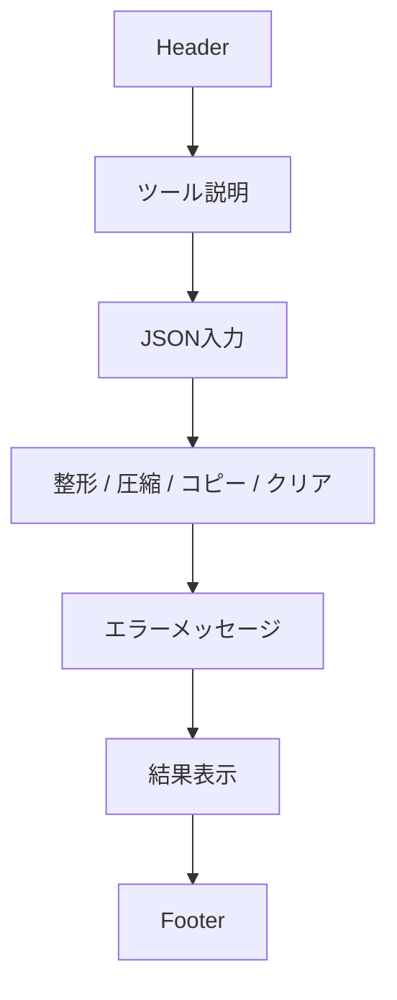

# ワイヤーフレーム

- Version: 1.0
- Last Updated: 2026-07-07
- Status: Draft

# 1. ユーザー操作フロー
## 正常系

JSON入力

↓

整形ボタン押下

↓

結果表示

↓

コピー

## 異常系

JSON入力

↓

整形ボタン押下

↓

エラーメッセージ表示

↓

JSON修正

↓

再度整形

# 2. 画面構成
Header

↓

説明

↓

入力欄

↓

操作ボタン

↓

エラーメッセージ

↓

出力欄

↓

Footer

# 3. ワイヤーフレーム

# 4. 各エリアの役割
## Header

ツール名を表示する。

## Tool Description

ツールの概要を表示する。

## Input

JSONを入力する。

## Buttons

JSONの整形・圧縮・コピー・クリアを行う。

## Error Message

入力エラーを分かりやすく表示する。

## Output

整形・圧縮後のJSONを表示する。

## Footer

GitHubへのリンクを表示する。